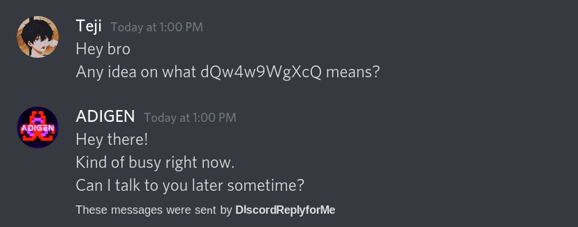

# Discord-Reply-ForMe

Discord-Reply-ForMe is a shell script that can send a preset message to a user by using an alias instead. It makes use of [shfire](https://github.com/ThatGeekyWeeb/shfire) to send a message via shell.

## NOTE

Using `shfire` is against Discord's TOS. This script utilizes it. Use at your own risk.

## Example



## Installation

```shell
git clone https://github.com/mradigen/discord-reply-forme.git # Clone this repo
cd discord-reply-forme
```

### Shfire

Look on how to get your auth key [here](https://github.com/ThatGeekyWeeb/shfire).

## Usage

In the same directory itself, run:

```sh
./discord-reply-forme NAME_OF_USER MESSAGE
```

For example:

```sh
./discord-reply-forme Josh busy
```

Shall send:

```
Hey there!
Kind of busy right now.
Can I talk to you later sometime?
```

## Customization

The shell script contains a bunch of options that you can use to configure it. They are present at the top of the script itself:

```sh
# Options
requestedUser=$1
message=$2
usersFile="./users"
messagesDir="./messages"
signatureFile="./signature"
```

### Users

To add a person to the alias list, you will require the ID of the DM channel between the two of you. Easiest way to obtain it is using Discord's web version. Navigate to the chat and look at the url. It shall look something like this:

```
https://discord.com/channels/@me/573922542252763931
```

You need the copy the ID after `@me/`, in this case, `573922542252763931` is the ID.

(psss this also works for server channels!)

Add an entry in the `users` file in such a format:

```ini
NAME=ID
```

Example:

```ini
Josh=573922542252763931
Alice=76492954235768945
Bob=69348739475938475
```

### Messages

You can add a file which contains the message you want to send. Store this file in the `messages` directory, or if you'd like to use another directory for messages instead, make sure to change the path in the script too.

Here's an example:

```sh
$ cat messages/busy
Hey there!
Kind of busy right now.
Can I talk to you later sometime?
```

### Signature

This is a text that is sent after the message prescribed is sent to the user. It's recommended to keep this in place so that the receiver knows that this is an automated message and not one by a real person.

## Future

I plan on removing the users list and instead use shfire's `list` to figure out the user ID. Currently I'd like to keep it as a simple and easy to use tool to send an instant text to anybody as writing the receiver's entire user can be quite a slow down.

## Contributing

Pull requests are welcome. For major changes, please open an issue first to discuss what you would like to change.

## License

[MIT](./LICENSE)